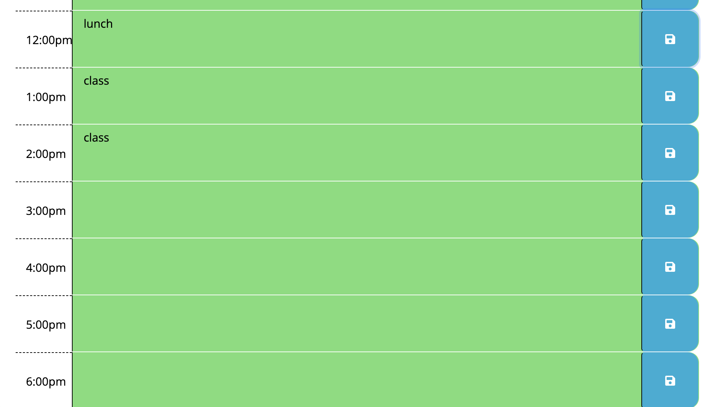

# Work Day Planner

## 1. Introduction

## 2. Project Goals

## 3. Reflection

## 4. Images of the website

## 5. Link To The Website

## 6. Credits

### 1.Introduction

As a coder it is extremely important to practice time management. In this project I have taken advantage of moment.js to build a week day callendar to help me better organize my day.

### 2.Project Goals

The week day planner that I created is invaluable to created a schedule. When the planner is opened the current date, day and time are displayed to give the greatest amount of accuracy. As the user scrolls down the planner application. They will notice that timeblocks are aloted for the 7am hour through the 6pm hour. Work days are irregular and some employees are on block scheduling, so I decided to extend past the typical 9-5 job. If the user clicks on a time block they will be able to write a message about a event. The written text for the event is saved into local storage. Even if you refresh the page the data remains.

### 3.Reflection

Writing an application is much easier using moment.js. It allows CSS and HTML to be inserted into a web page seemlessly. This project woud have taken me multiple hours to do if I had written all the code myself. This is a great time saving technique. In conclusion Moment JS hels with parsing, validating, manipulating and displaying date/time in very easy way to use.

### 4. Images of the site

Expected image of the application

Outcomes from different parts of the day:

### 5.Link to the Website

Please visit the following link to visit the work day scheduler.
https://grave019.github.io/work-day-scheduler/

### 6.Credits

To finish this product I took advantage of Eloquent JavaScript 3rd edition. You can visit the book at the following link.
https://eloquentjavascript.net

I also took advantage of moment.js web application building power. you can visit the website at the following link.
https://momentjs.com/docs/

Thank you for taking the time to look through my readme file and look at my work day planner.