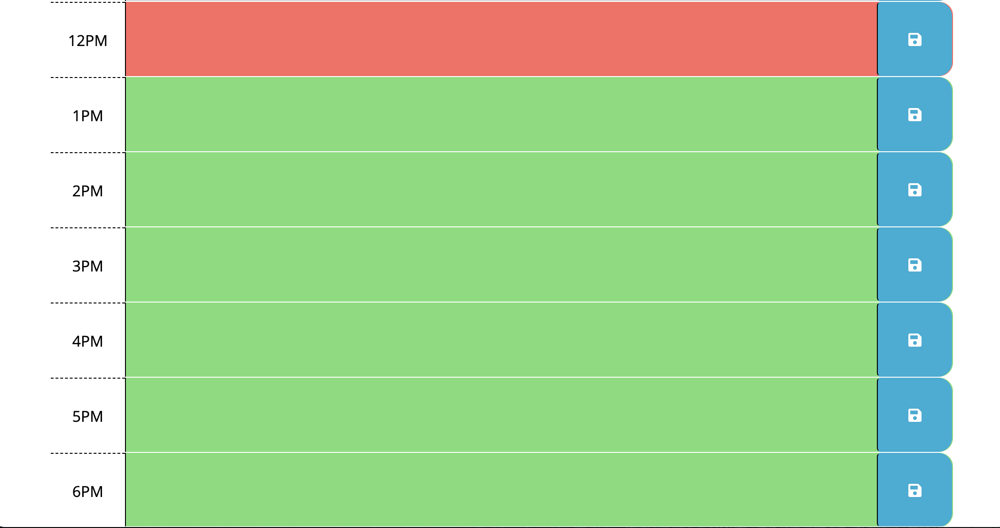

 
 
# Work Day Planner

## 1. Introduction

## 2. Project Goals

## 3. Reflection

## 4. Images of the website

## 5. Link To The Website

## 6. Credits

## 7. License

### 1.Introduction

As a coder it is extremely important to practice time management. In this project I have taken advantage of moment.js to build a week day callendar to help me better organize my day.

### 2.Project Goals

The week day planner that I created is invaluable to created a schedule. When the planner is opened the current date, day and time are displayed to give the greatest amount of accuracy. As the user scrolls down the planner application. They will notice that timeblocks are aloted for the 7am hour through the 6pm hour. Work days are irregular and some employees are on block scheduling, so I decided to extend past the typical 9-5 job. If the user clicks on a time block they will be able to write a message about a event. The written text for the event is saved into local storage. Even if you refresh the page the data remains.

### 3.Reflection

Writing an application is much easier using moment.js and bootstrap. It allows CSS and HTML to be inserted into a web page seemlessly. This project woud have taken me multiple hours to do if I had written all the code myself. This is a great time saving technique. In conclusion Moment JS helps with parsing, validating, manipulating and displaying date/time in very easy way to use. The " bootstrap shortcuts" allow for better time management that give you stying that is easier accessed. I look forward to more projects like this in the future.

### 4. Images of the site

Expected image of the application

Outcomes from different parts of the day:

### 5.Link to the Website

Please visit the following link to visit the work day scheduler.
https://grave019.github.io/work-day-scheduler/

### 6.Credits

To finish this product I took advantage of Eloquent JavaScript 3rd edition. You can visit the book at the following link.
https://eloquentjavascript.net

I also took advantage of moment.js web application building power. you can visit the website at the following link.
https://momentjs.com/docs/

I also used bootstrap to align the page correctly. The following link can be used to help style your page in the future. https://stackpath.bootstrapcdn.com/bootstrap/4.3.1/css/bootstrap.min.css

Thank you for taking the time to look through my readme file and look at my work day planner.

### 7. License

Copyright 2021 Brent Graves

  Permission is hereby granted, free of charge, to any person obtaining a copy of this software and associated documentation files (the "Software"), to deal in the Software without restriction, including without limitation the rights to use, copy, modify, merge, publish, distribute, sublicense, and/or sell copies of the Software, and to permit persons to whom the Software is furnished to do so, subject to the following conditions:
  
  The above copyright notice and this permission notice shall be included in all copies or substantial portions of the Software.
  
  THE SOFTWARE IS PROVIDED "AS IS", WITHOUT WARRANTY OF ANY KIND, EXPRESS OR IMPLIED, INCLUDING BUT NOT LIMITED TO THE WARRANTIES OF MERCHANTABILITY, FITNESS FOR A PARTICULAR PURPOSE AND NONINFRINGEMENT. IN NO EVENT SHALL THE AUTHORS OR COPYRIGHT HOLDERS BE LIABLE FOR ANY CLAIM, DAMAGES OR OTHER LIABILITY, WHETHER IN AN ACTION OF CONTRACT, TORT OR OTHERWISE, ARISING FROM, OUT OF OR IN CONNECTION WITH THE SOFTWARE OR THE USE OR OTHER DEALINGS IN THE SOFTWARE.
